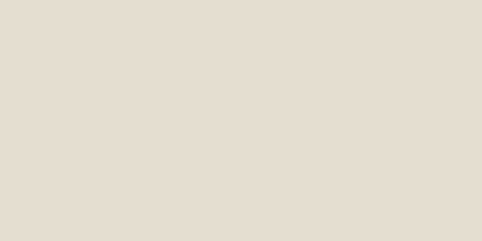
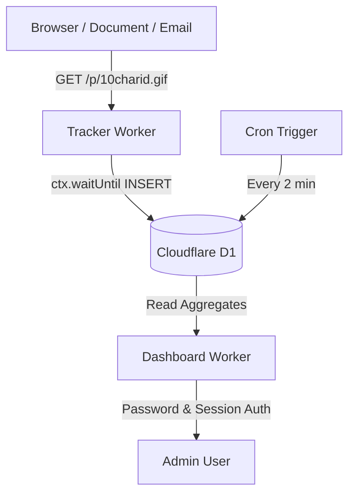

# SeenBase Analytics

[](https://nodejs.org/)
[](https://workers.cloudflare.com/)
[](https://astro.build/)
[](https://developers.cloudflare.com/d1/)
[](LICENSE)

**SeenBase Analytics** is a single-workspace, privacy-first Cloudflare application for pixel tracking, hourly aggregation, and analytics reporting.



---

## Architecture Overview



SeenBase Analytics is split into two lightweight Workers sharing a single Cloudflare D1 database:

- `apps/tracker`: Ultra-thin, latency-sensitive Worker that serves a 43-byte transparent `1×1 GIF` (`GET /p/<10-char-id>.gif`) and writes raw events asynchronously inside `ctx.waitUntil(...)`.
- `apps/dashboard`: Server-rendered Astro Worker providing a password-protected analytics control panel with charts, range filtering, breakdown cards, live hit logs, and CSV exports.
- `packages/db`: Single source of truth for the D1 database schema and migrations.

---

## Features

- **Zero Client-Side JavaScript Required**: Works in Markdown files, HTML emails, pitch decks, PDFs, or standard websites via a simple `` tag.
- **Privacy-First Pseudonymization**: Visitor IP addresses are immediately hashed using a day-scoped `HMAC-SHA-256(IP_HASH_KEY, YYYY-MM-DD + "\0" + IP)`. Raw IP addresses are **never** stored.
- **Hourly Cron Aggregation**: Background cron job computes hourly hits, uniques, and bot counts without blocking the pixel ingestion hot path.
- **Security & Bot Detection**: Automatically identifies and tags automated crawlers, scrapers, and uptime monitors.
- **Rich Analytics & Breakdowns**: Geographic location (Country, City), Network/ISP (ASN, Org), Client environment (Browser, OS, Language), and 5 standard UTM parameters (`utm_source`, `utm_medium`, `utm_campaign`, `utm_term`, `utm_content`).
- **Keyset Pagination & CSV Export**: Page through live hit logs with 50-row keyset pagination or export formula-safe RFC 4180 CSV files capped at 5,000 rows.
- **Single-Workspace Auth**: Simple password protection backed by timing-safe SHA-256 comparison and HMAC-signed session/CSRF tokens.

---

## 5-Minute Local Quick Start

### 1. Clone & Install Dependencies

```bash
git clone https://github.com/seenbase/seenbase-analytics.git
cd seenbase-analytics
npm install
```

### 2. Configure Local Environment Secrets

Copy the example environment files for both apps:

```bash
cp apps/tracker/.dev.vars.example apps/tracker/.dev.vars
cp apps/dashboard/.dev.vars.example apps/dashboard/.dev.vars
```

### 3. Run Local Database Migrations & Seed Data

Apply the D1 database schema and populate optional demo data:

```bash
npm run db:migrate:local
npm run db:seed:local
```

### 4. Start Local Development Servers

```bash
npm run dev
```

- **Tracker Worker**: `http://127.0.0.1:8787`
- **Dashboard Worker**: `http://127.0.0.1:4321`

Log in to the dashboard at `http://127.0.0.1:4321/login` using your configured `ADMIN_PASSWORD` (default in `.dev.vars.example`: `change_this_to_a_secure_password_123`).

---

## Copy-Paste Pixel Snippet Example

To track views on any webpage or HTML document, insert:

```html

```

Or with UTM campaign parameters:

```html

```

---

## Cloudflare Deployment

Deploying SeenBase Analytics to Cloudflare Workers and D1 takes under 5 minutes.

For detailed step-by-step instructions, see **[docs/deploy-cloudflare.md](docs/deploy-cloudflare.md)**.

---

## Environment Variables Configuration

| Variable | Scope | Description |
|---|---|---|
| `IP_HASH_KEY` | Tracker Secret | HMAC-SHA-256 secret key (at least 32 hex characters) used to derive day-scoped visitor pseudonyms. |
| `RETENTION_DAYS` | Tracker Var | Raw event retention cleanup depth in days (e.g. `90`). Set `-1` to disable deletion. |
| `ADMIN_PASSWORD` | Dashboard Secret | Admin login password (at least 12 characters). |
| `SESSION_SECRET` | Dashboard Secret | HMAC secret key (at least 32 hex characters) used to sign session and CSRF tokens. |
| `TRACKER_BASE_URL` | Dashboard Var | Public base URL of your deployed tracker Worker (e.g. `https://seenbase-analytics-tracker.subdomain.workers.dev`). |

---

## Privacy & Data Retention Semantics

1. **Pseudonymization**: Visitor IP addresses are hashed using `HMAC-SHA-256(IP_HASH_KEY, YYYY-MM-DD + "\0" + IP)`. The raw visitor IP address is **never** written to database tables or logs.
2. **Day-Scoped Hashes**: Because the UTC date is bound into the HMAC input, the same visitor IP address generates a completely different hash on subsequent UTC days. Cross-day tracking is prevented by design.
3. **Automated Retention Cleanup**: Daily cron cleanup deletes raw events older than `RETENTION_DAYS` that have already been aggregated. Hourly aggregated metrics in `aggregates` are kept permanently for historical trend reporting.

---

## Limitations

- **Unique Visitor Approximations**: Unique visitor metrics are computed via daily pseudonymous IP hashes. Visitors sharing a network NAT/proxy share the same daily hash.
- **Bot Detection**: Bot identification relies on known crawler and automation User-Agent tokens (`detectBot`).

---

## Repository Map

```
apps/
  tracker/      # Cloudflare Worker for 1x1 GIF tracking & cron aggregator
  dashboard/    # Server-rendered Astro dashboard Worker
packages/
  db/           # D1 schema migrations & TypeScript row interfaces
docs/
  deploy-cloudflare.md  # Production deployment guide
```

---

## License & Legal

- **Software License**: [MIT License](LICENSE) — Copyright (c) 2026 SeenBase.
- **Third-Party Notices**: See [THIRD_PARTY_NOTICES.md](THIRD_PARTY_NOTICES.md) for embedded icon attribution.
- **Contributing**: See [CONTRIBUTING.md](CONTRIBUTING.md) for local development workflows and pull request guidelines.
- **Security Policy**: See [SECURITY.md](SECURITY.md) for private vulnerability reporting.
